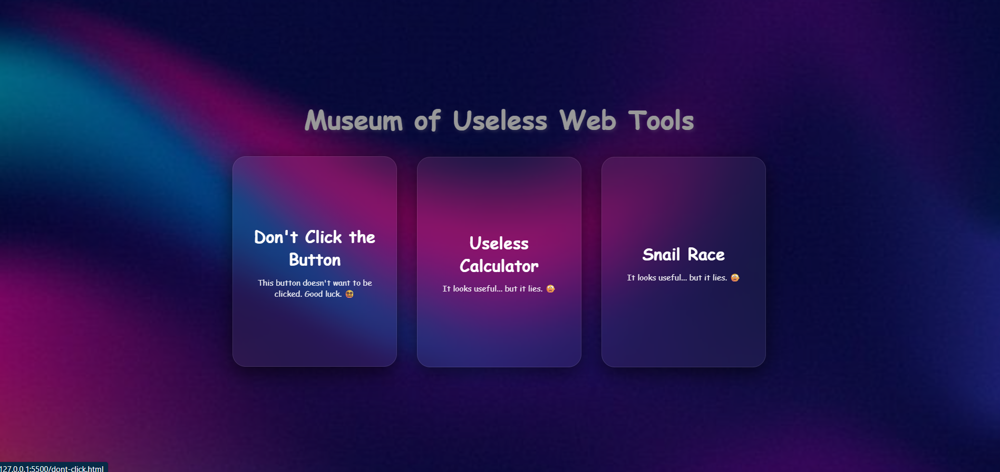
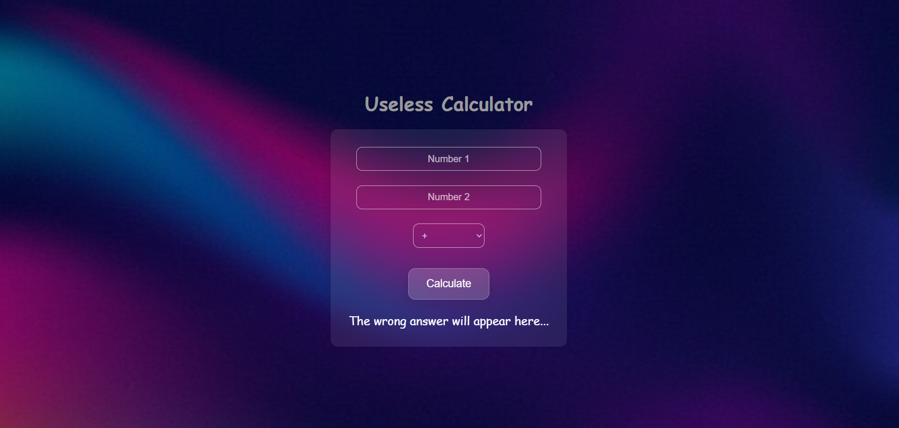

# Museum of Useless Web Tools 🎯


## Basic Details
### Team Name: NAZOOK


### Team Members
- Team Lead: Nasih - Farook College
- Team Partner: Marzook - Farook College

### Project Description
The Museum of Useless Web Tools is an online collection of web-based "tools" that serve no real function… and that’s the point. It’s a celebration of absurdity in the form of sliders, buttons, and toggles that exist just to exist.


## Technical Details
### Technologies/Components Used
For Software:
- HTML
- CSS
- Javascript


# installation commands
```bash
git clone https://github.com/marzook771/useless-poject-2.0.git
cd BugFree
```

# Screenshots (Add at least 3)




### Live Demo

[Click Me](https://marzook771.github.io/useless-poject-2.0/)


## Team Contributions
- Marzook: Ideas, HTML, CSS, Javascript
- Nasih: Ideas, HTML, CSS, Javascript

---
Made with ❤️ at TinkerHub Useless Projects 


